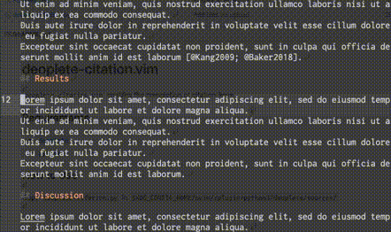

# deoplete-citation

`deoplete-citation` is the deoplete source.
`deoplete-citation` enables the completion of citation-keys.

## Requirements

- [`deoplete`](https://github.com/Shougo/deoplete.nvim)
- [`pybtex`](https://pybtex.org)

## How to Use

- Copy `deoplete-citation.py` in `$XDG_CONFIG_HOME/nvim/rplugin/python3/deoplete/sources/`.
- The prefix, `@`, will start the completion.
